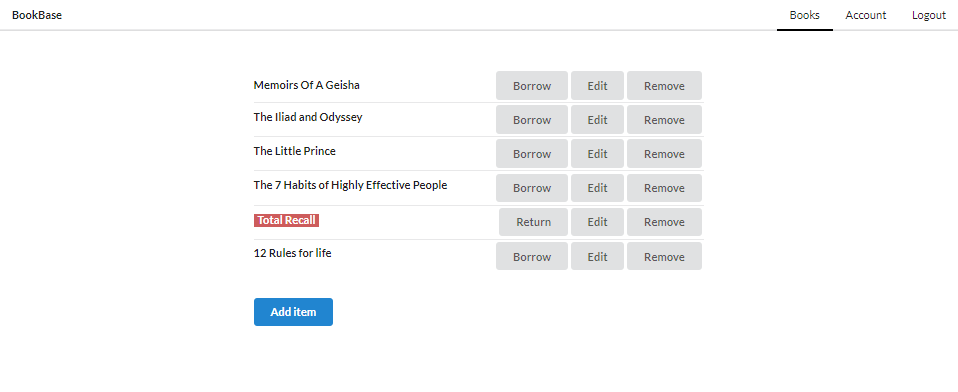

# BookBase

The project is ongoing test app for Node/Vue tech stack.



### Backend project:
- MongoDB server is prerequisite (https://www.mongodb.com/download-center/community)

- Setup
```
npm install
```

- Hot-reloads for development
```
nodemon
```

### Web project:

- Setup
```
npm install
```

- Compiles and hot-reloads for development
```
npm run serve
```

- Compiles and minifies for production
```
npm run build
```

- Lints and fixes files
```
npm run lint
```

### Key npm packages used:

- `express`
- `mongodb` / `mongoose`
- `jsonwebtoken` / `bcryptjs`
- `nodemon`
- `vuex` / `vuex-persist`

### Notes
In order to test the app both backend and web projects must be running. I used MongoDB Compass client for database inspection, but am open to suggestions. Also hit me back for any issues, forks etc. Cheers